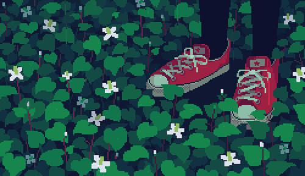

 Sarolanda<h1 align="center">Hello World! I'm Sara Holanda</h1>
<h3 align="center">🖥️ Front-end Developer</h3>

## 🚀 Tech Stack  
🔹 **Front-end:** ReactJS, Next.js, TailwindCSS  
🔹 **Back-end:** Node.js  
🔹 **Tools:** Git, Figma, Vercel  

Portfolio
🌟 https://portfolio-vys5-git-formulario-saras-projects-10a2db87.vercel.app

  

<h3 align="left">🌸 Let's Connect!  </h3>

<h3 align="left">Languages and Tools:</h3>

 
 
 
  
 
 
 
 
 

